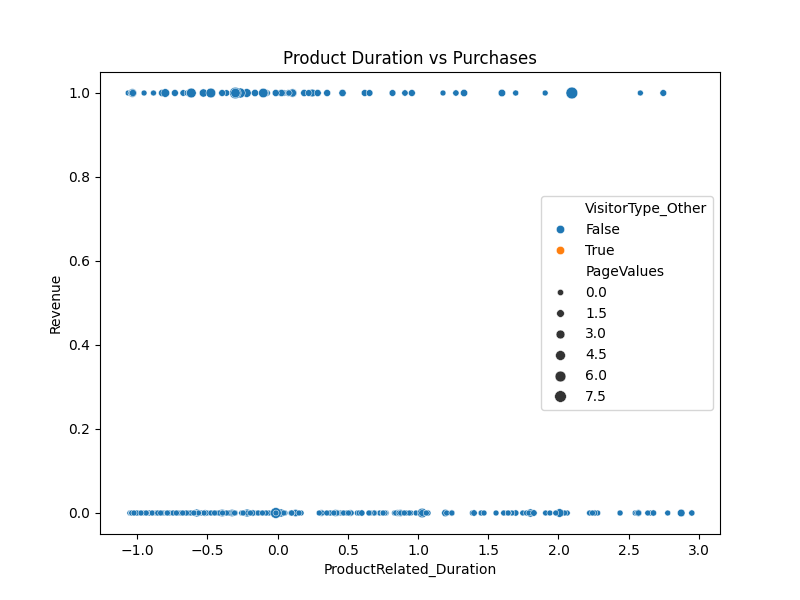

# 🛍️ User Detection & Behavior Analysis

Welcome to the **User Detection & Behavior Analysis** project! This initiative delves into the intricacies of online shopping behaviors, aiming to uncover patterns and insights that can enhance user experience and drive business decisions.



## 📊 Project Overview

This project analyzes the **Online Shoppers Purchasing Intention Dataset**, which contains 500 user entries. By examining various user behaviors and interactions, we aim to:

- Understand factors influencing purchasing decisions.
- Identify patterns in user navigation and session durations.
- Provide actionable insights for e-commerce platforms.

## 📁 Repository Contents

- `online_shoppers_intention.csv`: Original dataset from Kaggle.
- `cleaned_user_behavior.csv`: Preprocessed dataset after cleaning and transformation.
- `ecommerce_behavior_analysis.py`: Main script containing data analysis and visualization code.
- `eda_insights.txt`: Summary of exploratory data analysis findings.
- Visualizations:
  - `correlation_matrix.png`
  - `duration_by_visitor.png`
  - `duration_vs_purchases.png`
  - `purchases_by_region.png`
- `purchases_by_visitor_chart.json`: JSON representation of purchase data by visitor.

## 🔍 Key Insights

- **Session Duration**: Longer session durations often correlate with higher purchase probabilities.
- **Traffic Sources**: Direct traffic sources tend to have higher conversion rates compared to referral or organic sources.
- **Regional Behavior**: Certain regions exhibit distinct purchasing behaviors, indicating potential for targeted marketing strategies.

## 🛠️ Technologies Used

- **Programming Language**: Python
- **Libraries**:
  - `pandas` for data manipulation
  - `matplotlib` & `seaborn` for data visualization
  - `scikit-learn` for any applied machine learning models
- **Data Source**: [Online Shoppers Purchasing Intention Dataset](https://www.kaggle.com/datasets)

## 🚀 Getting Started

1. **Clone the repository**:
   ```bash
   git clone https://github.com/Arun/User-Detection-Analysis.git
   cd User-Detection-Analysis
